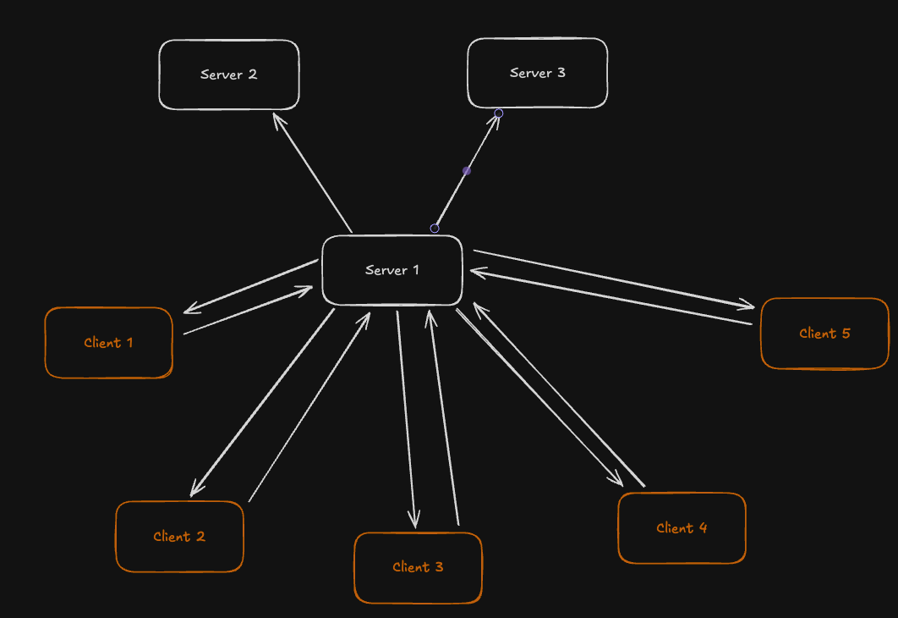

# Rede Social Distribuída

Uma implementação de rede social distribuída usando gRPC, com múltiplas instâncias de servidor, replicação de dados, sincronização de relógios e notificações em tempo real.

---

## Sumário

- [Funcionalidades](#funcionalidades)
- [Requisitos](#requisitos)
- [Dependências do Sistema](#dependências-do-sistema)
- [Instalação](#instalação)
- [Como rodar (Mac/Linux e Windows)](#como-rodar)
- [Como rodar usando apenas o Makefile](#como-rodar-usando-apenas-o-makefile)
- [Padrão de Mensagem](#padrão-de-mensagem)
- [Descrição dos Dados das Mensagens](#descrição-dos-dados-das-mensagens)
- [Diagrama de Arquitetura](#diagrama-de-arquitetura)

---

## Funcionalidades

- Arquitetura multi-servidor com replicação de dados (posts, mensagens diretas, seguidores)
- Notificações em tempo real para seguidores conectados
- Mensagens diretas entre usuários
- Sistema de seguidores (follow)
- Sincronização de relógios entre servidores (algoritmo de Berkeley)
- Implementações de cliente em Python, Go e Node.js
- Reconexão automática do cliente em caso de falha de servidor

---

## Requisitos

- **Python**
- **Go**
- **Node.js**
- **Protocol Buffers (protoc)**

## Dependências do Sistema

Antes de instalar as dependências do projeto, certifique-se de ter os seguintes programas instalados no seu sistema:

- **Python 3.11+**  
  (Recomendado usar [Miniconda](https://docs.conda.io/en/latest/miniconda.html) ou [Anaconda](https://www.anaconda.com/products/distribution))
- **Go 1.20+**
- **Node.js 18+**
- **npm** (geralmente já vem com o Node.js)
- **Protocol Buffers Compiler (`protoc`)**  
  - [Download aqui](https://github.com/protocolbuffers/protobuf/releases)
  - Certifique-se de adicionar o `protoc` ao PATH do sistema.
- **make**  
  - Mac/Linux: já vem instalado ou pode ser instalado via gerenciador de pacotes.
  - Windows: instale via [Git Bash](https://gitforwindows.org/), [WSL](https://learn.microsoft.com/pt-br/windows/wsl/), [MinGW](http://www.mingw.org/), [Cygwin](https://www.cygwin.com/) ou [Chocolatey](https://chocolatey.org/) (`choco install make`).
- **Conda** (opcional, mas recomendado para gerenciar o ambiente Python)
  - [Miniconda](https://docs.conda.io/en/latest/miniconda.html) ou [Anaconda](https://www.anaconda.com/products/distribution)

### Dependências Python

- grpcio
- grpcio-tools
- protobuf
- pytz

### Dependências Node.js

- @grpc/grpc-js
- @grpc/proto-loader
- luxon

### Dependências Go

- google.golang.org/grpc
- google.golang.org/protobuf

---

## Instalação

### 1. Clone o repositório

```bash
git clone https://github.com/floresss27/proj-sistemas-distribuidos.git
cd proj-sistemas-distribuidos
```

### 2. Instale as dependências

#### Python

```bash
pip install grpcio grpcio-tools protobuf pytz
```

#### Go

```bash
go mod download
```

#### Node.js

```bash
npm install
```

---

## Como rodar

### Gerar arquivos do gRPC (após alterar o .proto)

```bash
make proto
```

### Mac/Linux

#### Servidores (em 3 terminais diferentes):

```bash
make run-server1
make run-server2
make run-server3
```

#### Cliente Python

```bash
make run-python
```

#### Cliente Go

```bash
make run-go
```

#### Cliente Node.js

```bash
make run-node
```

---

### Windows

No Windows, use o terminal (cmd ou PowerShell) e execute:

#### Servidores (em 3 terminais diferentes):

```cmd
python server.py 50051
python server.py 50052
python server.py 50053
```

#### Cliente Python

```cmd
python client.py
```

#### Cliente Go

```cmd
go run client.go
```

#### Cliente Node.js

```cmd
node client.js
```

---

## Como rodar usando apenas o Makefile

Você pode executar todas as etapas do projeto utilizando apenas comandos do `make`:

### 1. Criar e ativar o ambiente Conda (Python)
```bash
make create-conda-env
conda activate redesocial
```

### 2. Instalar dependências Python
```bash
make install-python
```

### 3. Instalar dependências Go
```bash
make install-go
```

### 4. Instalar dependências Node.js
```bash
make install-node
```

### 5. Rodar os servidores (em 3 terminais separados)
```bash
make run-server1
make run-server2
make run-server3
```

### 6. Rodar os clientes
- Python:
  ```bash
  make run-python
  ```
- Go:
  ```bash
  make run-go
  ```
- Node.js:
  ```bash
  make run-node
  ```

### 7. Ajuda
```bash
make help
```

#### Observações
- O único passo manual é ativar o ambiente Conda após criá-lo (`conda activate redesocial`), pois o Makefile não consegue ativar ambientes Conda automaticamente para o shell do usuário.
- O Makefile cobre todas as dependências e execução dos servidores/clientes.
- Se você alterar o arquivo `.proto`, lembre-se de rodar o comando de geração do gRPC (`make proto`).

---

## Padrão de Mensagem

O projeto utiliza **Protocol Buffers** para serialização das mensagens e **gRPC** para comunicação entre clientes e servidores.  
O arquivo `social_network.proto` define todos os tipos de mensagens e serviços, incluindo:

- **Post**: postagem pública de um usuário
- **DirectMessage**: mensagem privada entre usuários
- **FollowRequest**: solicitação para seguir outro usuário
- **Notification**: notificação enviada para clientes conectados
- **ClockSyncRequest/Response**: sincronização de relógio entre servidores
- **Ack**: resposta de confirmação para operações

---

## Descrição dos Dados das Mensagens

- **Post**
  - `user`: string (nome do usuário)
  - `content`: string (conteúdo do post)
  - `timestamp`: int64 (data/hora do post)

- **DirectMessage**
  - `sender`: string (remetente)
  - `receiver`: string (destinatário)
  - `message`: string (conteúdo)
  - `timestamp`: int64 (data/hora)

- **FollowRequest**
  - `follower`: string (quem está seguindo)
  - `followee`: string (quem está sendo seguido)

- **Notification**
  - `user`: string (usuário que gerou o evento)
  - `content`: string (conteúdo do evento)
  - `timestamp`: int64 (data/hora do evento)

- **ClockSyncRequest/Response**
  - Sincronização de tempo entre servidores

- **Ack**
  - `success`: bool (sucesso da operação)
  - `message`: string (mensagem de status)

---

## Diagrama de Arquitetura



- **Clientes** se conectam a qualquer servidor disponível.
- **Servidores** replicam posts, mensagens e seguidores entre si.
- **Notificações** são enviadas em tempo real para clientes conectados.

---